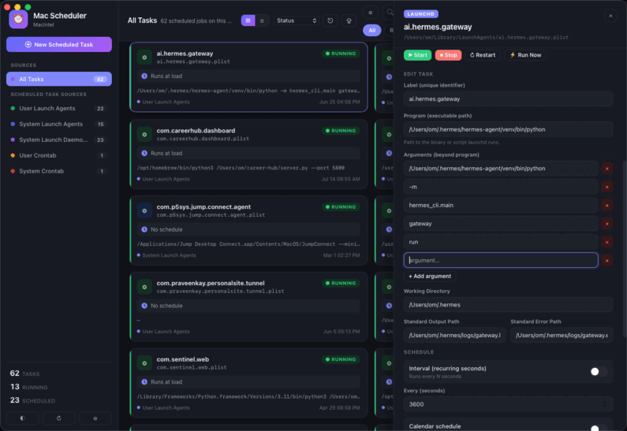
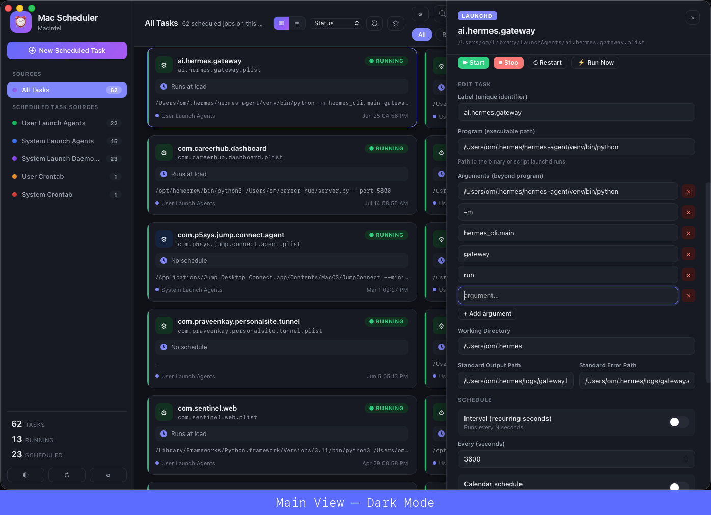
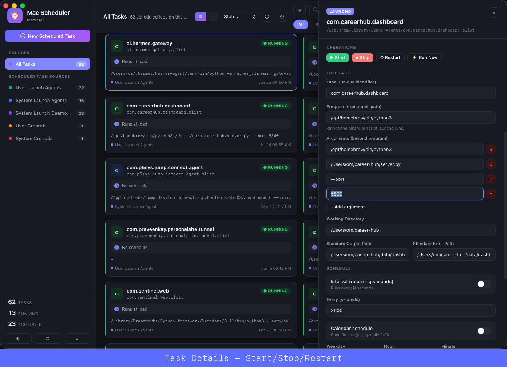
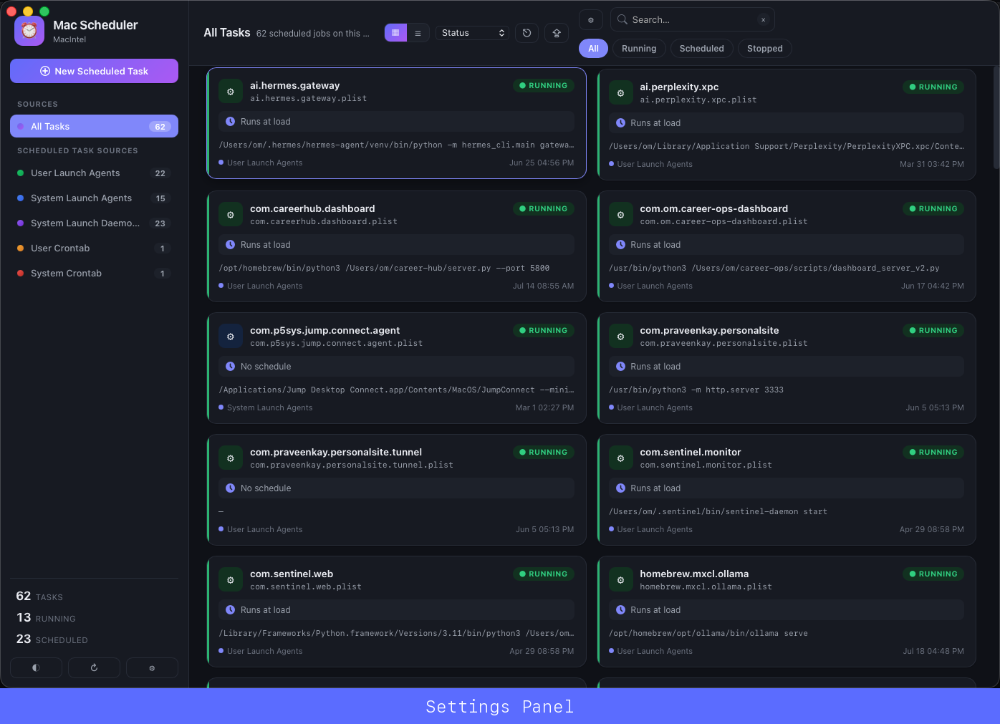
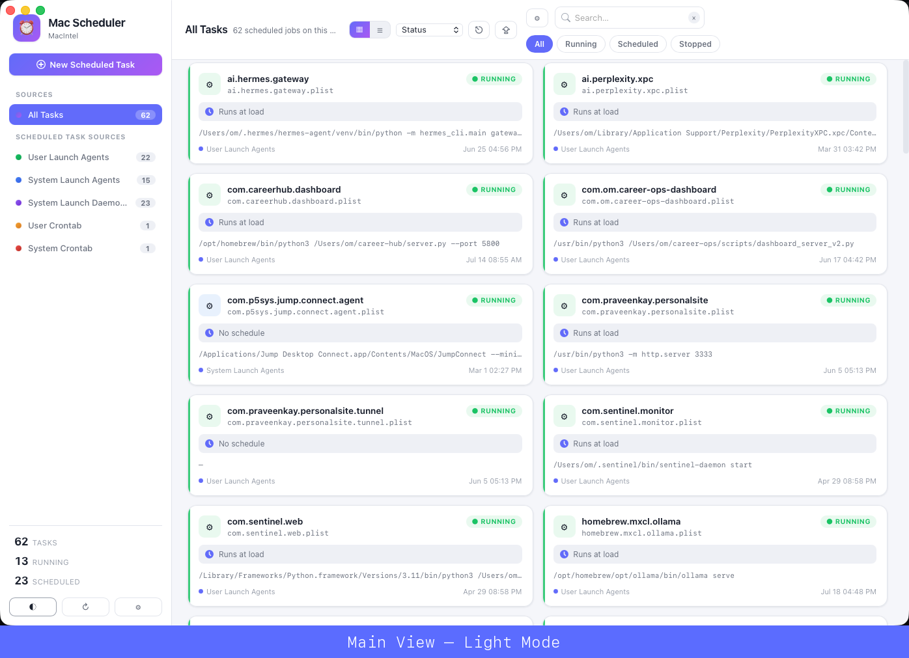
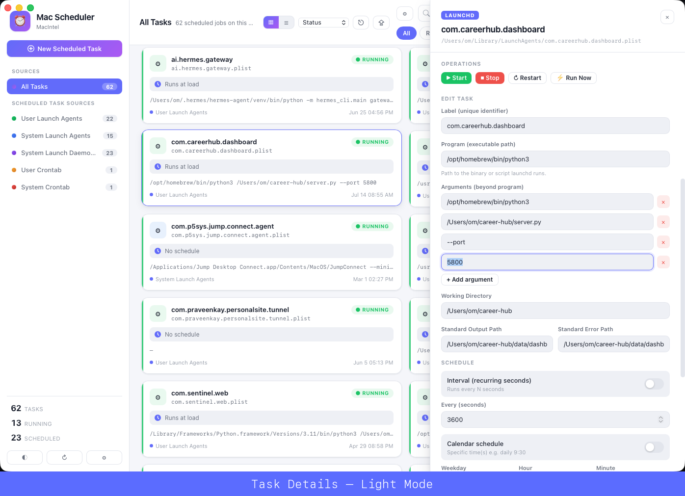
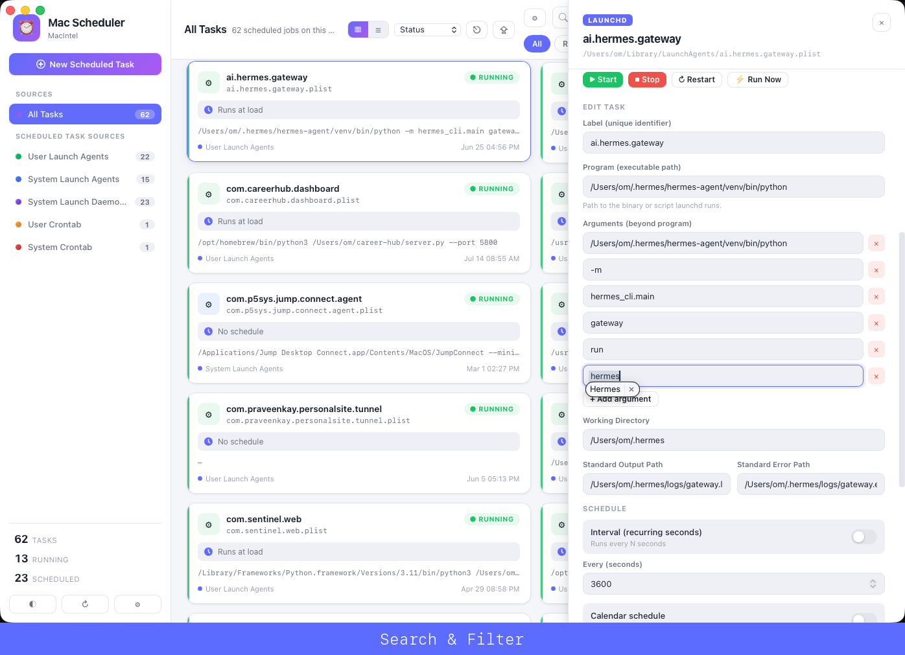

# Mac Scheduler

A native macOS app for managing **every scheduled task on your Mac** — launchd agents, launch daemons, and cron jobs — with full create, read, edit, delete, start, and stop controls in a single beautiful interface.

## Demo



---

## Screenshots

| Main View | Task Details | Settings |
|-----------|-------------|----------|
|  |  |  |

| Light Mode | Task Details (Light) | Search |
|------------|---------------------|--------|
|  |  |  |

---

## Features

- **Unified view** — See all 60+ scheduled tasks from 5 sources in one place
- **Full CRUD** — Create, edit, and delete launchd plists and cron jobs
- **Start / Stop / Restart** — Load, unload, kickstart, and reload tasks instantly
- **Live status** — Real-time running/stopped/scheduled indicators via `launchctl list`
- **Search & filter** — Find tasks by name, status, or source
- **Grid & list views** — Card layout or compact table view
- **Dark & light mode** — Automatic or manual theme toggle
- **AI-powered task creation** — Describe what you want in plain English, get a working plist
- **Export / Import** — Backup all tasks to JSON, restore on another Mac
- **Background mode** — Keep-alive agent keeps the server running when the window is closed
- **Auto-update checks** — Notifies you when a new version is available on GitHub
- **Zero dependencies** — Node backend uses only built-in modules; no npm install needed
- **Local-only** — Binds to `127.0.0.1`, no network exposure, no telemetry

---

## What It Manages

| Source | Location | Who Runs It |
|--------|----------|-------------|
| User Launch Agents | `~/Library/LaunchAgents/` | Your login session |
| System Launch Agents | `/Library/LaunchAgents/` | Every user session |
| System Launch Daemons | `/Library/LaunchDaemons/` | At boot, as root |
| User Crontab | `crontab -l` | Your cron scheduler |
| System Crontab | `/etc/crontab` | System-wide cron |

The app reads macOS's real scheduling model — launchd plists with `StartCalendarInterval`, `StartInterval`, `RunAtLoad`, `KeepAlive` — and interacts with `launchctl` to load, unload, kickstart, and manage jobs.

---

## Installation

### Option A — DMG Download (Recommended)

1. Go to [Releases](https://github.com/praveenkay/Mac-Scheduler/releases)
2. Download the right DMG for your Mac:

   | DMG | Architecture | For |
   |-----|-------------|-----|
   | `MacScheduler-<ver>-arm64.dmg` | Apple Silicon (M1/M2/M3/M4) | Macs from 2020+ |
   | `MacScheduler-<ver>-x86_64.dmg` | Intel | Macs from 2019 and earlier |
   | `MacScheduler-<ver>-universal.dmg` | Universal (both) | Any Mac |

3. Open the DMG, drag **Mac Scheduler.app** into **Applications**
4. Launch from Applications (right-click → Open the first time to bypass Gatekeeper)

### Option B — Command Line

```bash
curl -fsSL https://raw.githubusercontent.com/praveenkay/Mac-Scheduler/main/install/install.sh | zsh
```

This detects your architecture, downloads the matching DMG, installs to `/Applications`, enables background keep-alive, and requests permissions.

### Option C — Homebrew

```bash
brew tap praveenkay/mac-scheduler
brew install --cask mac-scheduler
```

### Option D — Build from Source

See [Build from Source](#build-from-source) below.

---

## Getting Started

### First Launch

1. Open **Mac Scheduler** from Applications
2. The app starts a local server on `http://127.0.0.1:8742`
3. Grant **Full Disk Access** when prompted (required to read system task files)
4. Your scheduled tasks appear automatically in the sidebar

### Granting Permissions

macOS protects scheduled-task files. On first launch:

1. Click **⚙ Settings → Open Full Disk Access settings**
2. Enable **Mac Scheduler** under *Files and Folders* or *Full Disk Access*
3. Quit and reopen the app

Editing `/Library/LaunchAgents`, `/Library/LaunchDaemons`, or `/etc/crontab` requires an admin user — the OS will prompt for your password.

---

## Usage Workflow

### 1. Browse Your Tasks

Launch Mac Scheduler to see all scheduled tasks from 5 sources in one unified view. The sidebar shows live counts for each source.


**Key features:**
- **61 tasks** displayed as cards with status indicators (green = running, yellow = scheduled, red = stopped)
- **Sidebar** lists all sources: User Launch Agents, System Launch Agents, System Launch Daemons, User Crontab, System Crontab
- **Status bar** at the bottom shows totals: 61 Tasks, 13 Running, 23 Scheduled

### 2. Filter and Search

Use the search bar and filter chips to find specific tasks quickly.


- **Search** — Type any keyword to filter by name or path
- **Filter chips** — Click All, Running, Scheduled, or Stopped to filter by status
- **Sort** — Use the dropdown to sort by Status, Name (A-Z), or Source

### 3. View Task Details

Click any task card to open the detail drawer with full controls.


**Task operations:**
| Button | Action | Description |
|--------|--------|-------------|
| **▶ Start** | `bootout` + `load` | Enables and loads the task |
| **⏹ Stop** | `bootout` | Stops and disables the task |
| **↻ Restart** | `bootout` + `load` | Restarts the task |
| **⚡ Run Now** | `load` + `kickstart` | Forces immediate execution |

### 4. Edit Tasks

In the detail drawer, you can modify every aspect of a launchd task:

- **Label** — Unique identifier (e.g., `com.example.myagent`)
- **Program** — Path to the binary or script
- **Arguments** — Command-line arguments
- **Working Directory** — Where the task runs from
- **Schedule** — Calendar interval, interval, or cron expression
- **Options** — Run at load, Keep alive
- **Raw XML** — Toggle to edit the plist directly

### 5. Create New Tasks

Click **+ New Scheduled Task** in the sidebar to create a new launchd agent or cron job.

**With AI:**
1. Open the new task dialog
2. Type a description: *"Back up my Documents folder every night at 2 AM"*
3. Click **Generate** — the AI creates a working plist
4. Review and save

**Manual:**
1. Choose a source (User Launch Agents recommended)
2. Fill in the form with label, program, arguments, and schedule
3. Click **Save**

### 6. Toggle Theme

Switch between dark and light mode using the theme button in the sidebar footer.

| Dark Mode | Light Mode |
|-----------|------------|
|  |  |

---

## Usage Guide

### Viewing Tasks

- **Sidebar** — Shows all 5 task sources with live counts
- **All Tasks** — View everything at once (61 tasks in the screenshot)
- **Source filter** — Click a source in the sidebar to filter
- **Status filter** — Use the top-right chips: All, Running, Scheduled, Stopped
- **Search** — Type in the search bar to filter by name or path
- **Sort** — Click the sort dropdown: Status, Name (A-Z), or Source

### Task Operations

Click any task card to open the detail drawer with these operations:

| Button | Action | Description |
|--------|--------|-------------|
| **▶ Start** | `bootout` + `load` | Enables and loads the task |
| **⏹ Stop** | `bootout` | Stops and disables the task |
| **↻ Restart** | `bootout` + `load` | Restarts the task |
| **⚡ Run Now** | `load` + `kickstart` | Forces immediate execution |

### Editing Tasks

In the detail drawer you can:

- **Edit the label** — Unique identifier (e.g., `com.example.myagent`)
- **Change the program** — Path to the binary or script
- **Modify arguments** — Add, remove, or reorder command-line arguments
- **Set working directory** — Where the task runs from
- **Configure logging** — Stdout and stderr file paths
- **Adjust schedule** — Calendar interval, interval, or cron expression
- **Toggle options** — Run at load, Keep alive
- **Edit raw XML** — Toggle "Show raw XML plist" for advanced editing

### Creating Tasks

1. Click **+ New Scheduled Task** in the sidebar
2. Choose a source (User Launch Agents is recommended for most tasks)
3. Fill in the form or describe what you want in the AI prompt
4. Click **Save** — the plist is written to disk and loaded

### AI Task Creation

1. Open the new task dialog
2. Type a description: *"Back up my Documents folder every night at 2 AM"*
3. Click **Generate** — the AI creates a working launchd plist
4. Review and edit if needed, then save

Requires [ApplyOpps](https://github.com/praveenkay/applyopps) running locally on port 5290.

### Cron Jobs

- **Add a job** — Fill in Minute, Hour, Day, Month, Weekday, Command and click Add
- **Remove a job** — Click "remove" next to any cron line
- **Edit raw crontab** — Edit the textarea directly and click Save
- **Clear all** — Removes every cron job for that source

### Export & Import

- **Export** — Click the ⎋ button to download all tasks as JSON
- **Import** — Click the ⇪ button to upload a JSON backup and restore tasks

### Settings

Open with the ⚙ button in the sidebar or top bar:

| Tab | Options |
|-----|---------|
| **General** | Run in background, Dark mode, Auto-refresh, Auto update check |
| **Sources** | View/edit task sources, Open Full Disk Access, Add custom folders |
| **AI** | Configure ApplyOpps provider and model |
| **About** | Version info, Check for updates, Uninstall |

### Background Mode

Enable **⚙ Settings → Run in background** to keep the server alive when the window is closed. The app installs a per-user LaunchAgent (`com.praveenkay.macscheduler.keepalive`).

Reopen the UI anytime:
```bash
open -a 'Mac Scheduler'
# or visit http://127.0.0.1:8742 in any browser
```

### Auto-Update

On launch, the app checks GitHub for a newer release. If one is available, a banner appears with a link to download it. Toggle this off in **⚙ Settings → Auto check for updates**.

---

## Architecture

```
Mac Scheduler.app/
├── Contents/
│   ├── MacOS/MacScheduler          # Swift native shell (Cocoa + WebKit)
│   ├── Resources/
│   │   ├── server.js               # Node.js API server (zero deps)
│   │   ├── public/
│   │   │   ├── index.html          # App shell
│   │   │   ├── app.js              # Frontend logic (vanilla JS)
│   │   │   └── style.css           # Styles (CSS custom properties)
│   │   └── install/                # Permission scripts
│   └── Info.plist
```

- **Native shell** (`native/main.swift`) — Creates a borderless WKWebView window with a transparent titlebar, launches the Node server, and handles URL scheme activation (`macscheduler://`)
- **API server** (`server.js`) — HTTP on `127.0.0.1:8742`, reads/writes launchd plists and crontabs, manages the keep-alive agent
- **Web frontend** (`public/`) — Vanilla JS, no framework, no build step, no npm

---

## Build from Source

Requires Node.js (>= 18) and Xcode Command Line Tools.

```bash
git clone https://github.com/praveenkay/Mac-Scheduler.git
cd Mac-Scheduler
```

### Run in Development

```bash
node server.js
# → http://127.0.0.1:8742
```

### Build the Native App

```bash
# Your architecture only
./build-native.sh 0.4.2 arm64

# Specific architecture
./build-native.sh 0.4.2 x86_64    # Intel
./build-native.sh 0.4.2 arm64     # Apple Silicon
```

Output: `/tmp/macscheduler_build_<arch>/Mac Scheduler.app`

### Build DMGs

```bash
# All architectures (arm64 + x86_64)
./make-dmg.sh 0.4.2

# Specific architecture
./make-dmg.sh 0.4.2 arm64
./make-dmg.sh 0.4.2 x86_64
```

Output: `dist/MacScheduler-<ver>-<arch>.dmg`

### Build Universal Binary

```bash
./build-native.sh 0.4.2 arm64
./build-native.sh 0.4.2 x86_64

lipo -create \
  /tmp/macscheduler_build_arm64/Mac\ Scheduler.app/Contents/MacOS/MacScheduler \
  /tmp/macscheduler_build_x86_64/Mac\ Scheduler.app/Contents/MacOS/MacScheduler \
  -output /tmp/MacScheduler
```

---

## Troubleshooting

### App shows "Failed to load tasks"

- Grant Full Disk Access in System Settings → Privacy & Security → Files and Folders
- Quit and reopen the app

### Tasks don't appear

- Some system sources require sudo. The app will prompt when needed.
- Check that the source folder exists: `ls ~/Library/LaunchAgents/`

### Server won't start (port 8742 in use)

```bash
lsof -i :8742
kill <PID>
```

### Blank window or rendering issues

- Quit the app completely: `osascript -e 'quit app "Mac Scheduler"'`
- Delete the cached build: `rm -rf /tmp/macscheduler_build_*`
- Reinstall from the DMG

### Uninstall completely

```bash
curl -fsSL https://raw.githubusercontent.com/praveenkay/Mac-Scheduler/main/install/uninstall.sh | zsh
```

Or manually:
```bash
rm -rf "/Applications/Mac Scheduler.app"
launchctl bootout "gui/$(id -u)/com.praveenkay.macscheduler.keepalive"
rm -rf ~/.config/macscheduler
```

---

## Security

- **Local-only** — Server binds to `127.0.0.1`, never exposed to the network
- **No telemetry** — Nothing leaves your Mac
- **No dependencies** — Node backend uses only built-in modules (zero npm)
- **Ad-hoc signed** — The app is signed for local Gatekeeper acceptance

---

## API Reference

The local server exposes these endpoints on `http://127.0.0.1:8742`:

| Endpoint | Method | Description |
|----------|--------|-------------|
| `/api` | GET | App version, user, host, source count |
| `/api/tasks` | GET | All scheduled tasks with parsed metadata |
| `/api/sources` | GET | Available task sources |
| `/api/sources` | POST | Add a custom folder source |
| `/api/sources` | PUT | Edit a source |
| `/api/job/<id>` | GET | Single task detail |
| `/api/job/<id>` | POST | Start, stop, restart, or run a task |
| `/api/job/<id>` | PUT | Update a task's plist or crontab |
| `/api/job/<id>` | DELETE | Delete a task |
| `/api/tasks` | POST | Create a new task |
| `/api/keepalive` | POST | Enable/disable background mode |
| `/api/permissions` | POST | Open System Settings for disk access |
| `/api/ai` | GET/POST | Get/set AI provider config |
| `/api/ai/generate` | POST | Generate a plist from natural language |
| `/api/export` | GET | Export all tasks as JSON |
| `/api/import` | POST | Import tasks from JSON |
| `/api/update` | GET | Check GitHub for newer releases |
| `/api/open` | POST | Open a URL in the default browser |
| `/api/uninstall` | POST | Remove app data and optionally the .app |

---

## License

MIT © Praveen Kay
