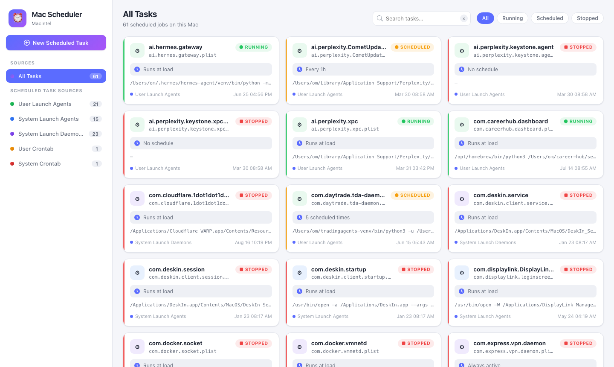

# Mac Scheduler

A beautiful control center for **every scheduled task on your Mac** — with full
create / read / edit / delete on each one, wrapped in a native macOS app.



## What it manages

| Source | Location | Notes |
|--------|----------|-------|
| User Launch Agents | `~/Library/LaunchAgents/` | Run in your login session |
| System Launch Agents | `/Library/LaunchAgents/` | Every user session |
| System Launch Daemons | `/Library/LaunchDaemons/` | Run at boot, as root |
| User Crontab | `crontab -l` | Classic cron scheduler |
| System Crontab | `/etc/crontab` | System-wide cron |

The app reads macOS's real scheduling model (launchd plists with
`StartCalendarInterval`, `StartInterval`, `RunAtLoad`, `KeepAlive`) and lets you
load / unload / run jobs through `launchctl`.

## Install

### Option A — Direct DMG (easiest)

1. Download `MacScheduler-<version>-arm64.dmg` (Apple Silicon) or
   `MacScheduler-<version>-x86_64.dmg` (Intel) from
   [Releases](https://github.com/praveenkay/Mac-Scheduler/releases).
2. Open the DMG, drag **Mac Scheduler.app** into **Applications**.
3. Launch it from Applications (right-click → Open the first time).

### Option B — Command line (curl)

```bash
curl -fsSL https://raw.githubusercontent.com/praveenkay/Mac-Scheduler/main/install/install.sh | zsh
```

Detects your architecture, downloads the matching DMG, installs to
`/Applications`, enables background keep-alive, and requests permissions.

### Option C — Homebrew

```bash
brew tap praveenkay/mac-scheduler
brew install --cask mac-scheduler
```

### Uninstall

```bash
curl -fsSL https://raw.githubusercontent.com/praveenkay/Mac-Scheduler/main/install/uninstall.sh | zsh
# or
rm -rf "/Applications/Mac Scheduler.app"
launchctl bootout "gui/$(id -u)/com.praveenkay.macscheduler.keepalive"
```

## Permissions

macOS protects scheduled-task files. When you first install:

- Open **⚙ Settings → Open Full Disk Access settings** (in the app) and enable
  **Mac Scheduler** under *Files and Folders*.
- Editing `/Library/LaunchAgents`, `/Library/LaunchDaemons` or `/etc/crontab`
  requires an admin user; the OS will prompt.

## Keep running in the background

Enable **⚙ Settings → Run in background** — the app installs a per-user
LaunchAgent (`com.praveenkay.macscheduler.keepalive`) that keeps the scheduler
server alive even when the window is closed. Open the UI anytime with
`open -a 'Mac Scheduler'` or http://127.0.0.1:8742.

## Build from source

Requires Node.js (>= 18) and Xcode Command Line Tools.

```bash
# Web app (dev)
node server.js            # → http://127.0.0.1:8742

# Native .app + DMG for all archs
./make-dmg.sh 1.0.0 arm64 x86_64     # → dist/*.dmg
```

## Security

- The server binds only to `127.0.0.1` — nothing is exposed to your network.
- No telemetry, no external calls, no data leaves your Mac.
- Node backend uses only built-in modules (zero npm dependencies).

## License

MIT © Praveen Kay